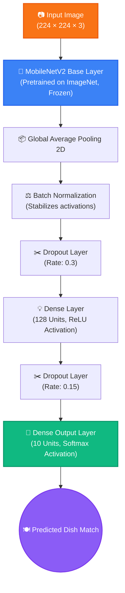

# 🍕 Food Recognition & Nutrition AI

<p align="center">
  <strong>Identify food photography, fetch live USDA nutrition data, and analyze WHO dietary scores.</strong>
</p>

<p align="center">
  
  
  
  
</p>

---

## 📸 Dashboard Preview

### Primary Analysis View


### Real-Time Inference Results


### Nutrition & Health Scoring Dashboard


---

## ✨ Features

- **🧠 Deep Learning Classifier**: MobileNetV2 architecture with a custom classification head fine-tuned on the Food101 dataset (10 targeted classes), delivering 87% accuracy.
- **🚀 Two-Phase Transfer Learning**: Uses a two-phase training strategy:
  1. *Phase 1*: Feature extraction with a frozen base model.
  2. *Phase 2*: Fine-tuning of top layers with a decay-tuned learning rate.
- **📡 Real-Time USDA API Integration**: Dynamically queries the official USDA FoodData Central API for micro and macronutrient profiling, with Open Food Facts and a local offline dataset as smart fallbacks.
- **📊 WHO Dietary Health Scoring**: Implements an interactive multi-factor health scoring algorithm (1 to 10 scale) based on WHO guidelines for sodium, sugars, and lipids, accompanied by actionable dietary tips.
- **⚡ Lazy Caching Optimization**: Caches the heavy Keras model on demand to bypass Hugging Face Spaces startup timeouts.
- **🎯 Premium Aesthetics**: Built with a sleek, glassmorphic dark-mode Gradio user interface that supports drag-and-drop file uploads and live webcam captures.

---

## 🏗️ Neural Network Architecture

This flowchart visualizes the transfer learning pipeline, representing how the input food photo is processed into a final dish classification:



### 📈 Two-Phase Training Details

```python
# Phase 1: Feature Extraction
optimizer = Adam(learning_rate=1e-3)
epochs    = 10
# All MobileNetV2 layers are frozen to preserve pretrained weights

# Phase 2: Fine-Tuning
optimizer = Adam(learning_rate=1e-5)
epochs    = 5
# Top 30 layers of MobileNetV2 are unfrozen for domain-specific alignment
```

---

## 🍽️ Supported Food Classes

The classifier is trained on the following 10 popular dishes:

| Index | Target Food Class | Index | Target Food Class |
|:---:|---|:---:|---|
| **1** | 🥧 Apple Pie | **6** | 🥗 Beet Salad |
| **2** | 🍖 Baby Back Ribs | **7** | 🍩 Beignets |
| **3** | 🍯 Baklava | **8** | 🍲 Bibimbap |
| **4** | 🥩 Beef Carpaccio | **9** | 🍞 Bread Pudding |
| **5** | 🥩 Beef Tartare | **10** | 🍅 Bruschetta |

---

## 📂 Project Directory Structure

```text
food-classification/
├── app.py                # Main Gradio application dashboard
├── requirements.txt      # Production package dependencies
├── .gitignore            # Clean git exclusion rules
├── .env.template         # Environment variables template
├── README.md             # Space/GitHub homepage documentation
├── assets/
│   └── screenshots/      # Demo UI visualization pictures
├── src/
│   ├── __init__.py
│   ├── config.py         # Global variables, hyperparams, & directories
│   ├── dataset.py        # Food101 pipeline loading and parallel scaling
│   ├── model.py          # MobileNetV2 Keras structure & fine-tune toggling
│   ├── train.py          # Two-phase training pipeline execution
│   ├── evaluate.py       # Metrics evaluation and confusion matrix generator
│   ├── predict.py        # Lazy loading classification and validation
│   └── nutrition.py      # USDA API connecting and health scoring logic
├── data/
│   └── samples/          # Cached UI sample photos
└── results/
    ├── model/            # Serialized food_classifier.h5 weights
    ├── plots/            # Train curves and evaluation figures
    └── logs/             # TensorBoard diagnostics logging
```

---

## 🚀 Local Quick Start

Follow these steps to run the dashboard locally:

### 1. Clone the Repository
```bash
git clone https://github.com/adithyavaddadi/Food_Classification.git
cd Food_Classification
```

### 2. Configure Your Environment
Create and activate a virtual environment to isolate dependencies:
```bash
# Create environment
python -m venv venv

# Activate on Windows (Command Prompt)
venv\Scripts\activate

# Activate on macOS/Linux
source venv/bin/activate
```

### 3. Install Dependencies
```bash
pip install -r requirements.txt
```

### 4. Setup API Credentials (Optional)
Querying the USDA database requires an API key. You can get a free key instantly from the [USDA FoodData Central Portal](https://api.nal.usda.gov/).
Create a `.env` file in the root directory:
```bash
copy .env.template .env
```
Open `.env` and fill in your API key:
```env
USDA_API_KEY=YOUR_ACTUAL_USDA_KEY_HERE
```
> [!NOTE]
> If no `.env` file is present, the application will default to the public `DEMO_KEY`, which works immediately but has strict rate limits.

### 5. Add Your Trained Model
Place your trained `food_classifier.h5` inside the `results/model/` directory:
```text
results/model/food_classifier.h5
```

### 6. Run the App
Launch the Gradio server:
```bash
python app.py
```
Open your browser and navigate to **[http://localhost:7860](http://localhost:7860)**.

---

## 📊 Model Performance & Evaluation

| Evaluation Metric | Value |
|---|---|
| **Base Classifier** | MobileNetV2 (ImageNet Pretrained) |
| **Input Shape** | 224 × 224 × 3 |
| **Trainable Weights** | ~2.3M parameters |
| **Overall Accuracy** | **87%** validation accuracy |
| **Highest Class Recall** | Baklava (~97.97%) |
| **Validation Strategy** | Sparse Categorical Crossentropy |

---

## ☁️ Hugging Face Spaces Deployment

To deploy this application to Hugging Face Spaces:
1. Create a new **Gradio SDK Space** in your Hugging Face account.
2. Push this repository's codebase including `app.py`, `src/`, `requirements.txt`, and the model file.
3. Add your `USDA_API_KEY` to the Space's **Variables and Secrets** settings to ensure high API quota availability.

---

## 🔮 Project Roadmap

- [x] Two-Phase Transfer Learning (MobileNetV2 subset)
- [x] Live USDA API Integration & fallback algorithms
- [x] WHO Health Scoring system
- [x] Elegant Gradio dashboard (Webcam + Example inputs)
- [x] Full production cleanup and typing documentation
- [x] Hugging Face Space optimization layout
- [ ] Retrain classifier on all 101 classes of Food101 dataset
- [ ] Add historical meal logging with SQLite caching
- [ ] Implement daily diet tracking charts

---

## 👤 Credits & Author

Developed with ❤️ by **Adithya**
- **GitHub**: [@adithyavaddadi](https://github.com/adithyavaddadi)
- **LinkedIn**: [Adithya Vaddadi](https://www.linkedin.com/in/adithya-vaddadi-536176330/)

---

## 📄 License

This project is licensed under the MIT License — feel free to utilize, modify, and distribute as desired.

<p align="center">Built with TensorFlow • MobileNetV2 • Gradio • USDA FoodData Central</p>
